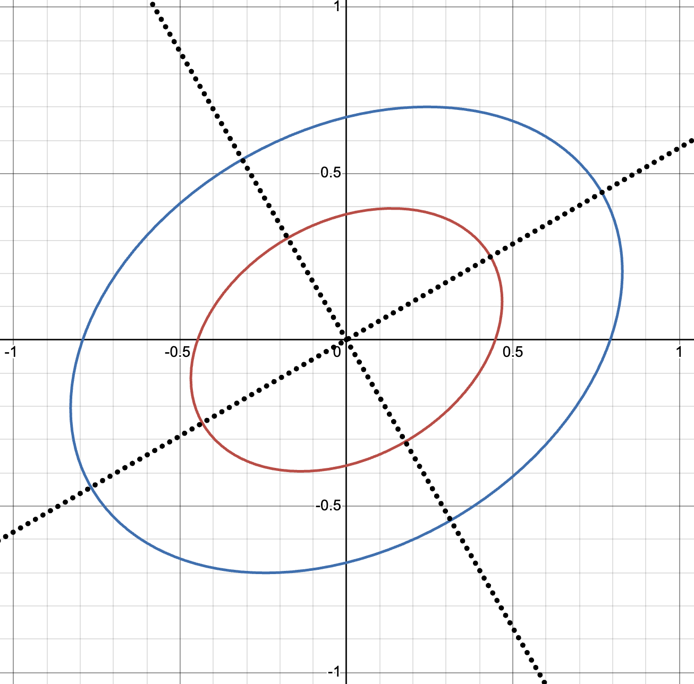

```{r message = FALSE, warning = FALSE, echo = FALSE}
library(pracma)
```

# (1) Angle Between Two Vectors

## (a) get_angle() Counterclockwise angle between two vectors
```{r}
get_angle = function(x, y) {
  # Calculates the (counterclockwise) angle between two 2-dimensional vectors
  
  # Calculate angle 
  radians <- acos(dot(x,y) / (Norm(x) * Norm(y)))
  degrees <- radians * (180/pi)
  
  # Make angle counterclockwise
  cross_prod <- x[1]*y[2] - x[2]*y[1]

  if(cross_prod < 0) {
    degrees <- 360 - degrees
  }
  
  degrees
}
```

## (b) Vector pairs giving 17, 110, and 270 degrees
```{r}
get_angle(c(1,0), c(cos(17 * (pi/180)),sin(17 * (pi/180))))

get_angle(c(1,0), c(cos(110 * (pi/180)),sin(110 * (pi/180))))

get_angle(c(1,0), c(cos(270 * (pi/180)),sin(270 * (pi/180))))
```
\newpage

# (2) Matrix Inverse Properties

## Given that $A^{-1}$ and $B^{-1}$ exist:

## (a) Show that $(A^T)^{-1}=(A^{-1})^T$

$$AA^{-1}=I$$
$$(AA^{-1})^T=I^T$$
$$A^T(A^{-1})^T=I$$
$$(A^T)^{-1}A^T(A^{-1})^T=(A^T)^{-1}I$$
$$(A^{-1})^T=(A^T)^{-1}$$

## (b) Show that $(AB)^{-1}=B^{-1}A^{-1}$


$$I=AA^{-1}$$
$$I=AIA^{-1}$$
$$I=A(BB^{-1})A^{-1}$$
$$I=(AB)(B^{-1}A^{-1})$$
$$(AB)(AB)^{-1}=(AB)(B^{-1}A^{-1})$$
$$(AB)^{-1}(AB)(AB)^{-1}=(AB)^{-1}(AB)(B^{-1}A^{-1})$$
$$(AB)^{-1}=B^{-1}A^{-1}$$

# (3) Eigenvalue Property

## $A$ is $kxk$ matrix and $P$ is $kxk$ orthogonal matrix. Show that $P^TAP$ and $A$ have the same eigenvalues.

$$Ax=\lambda x$$
$$\text{Let } x=Py \text{ where y is a vector.}$$
$$\text{For an orthogonal matrix }, P^T=P^{-1} \text{, so: }$$
$$x=Py$$
$$P^Tx=P^TPy$$
$$P^Tx=y$$

$$\text{Using these facts, we have:}$$
$$(P^TAP)y=P^TAx=P^T\lambda x=\lambda P^Tx=\lambda y$$
$$\text{So, }(P^TAP)y=\lambda y$$
$$\text{So, } A \text{ and } P^TAP \text{ have the same eigenvalues } \lambda .$$
\newpage

# (4) Ellipses

## Suppose $c^2=5x_1^2-2\sqrt{3}x_1x_2+7x_2^2$ is the distance from $x = [x_1 x_2]^T$ to the origin for $x \neq 0.$ Given $c^2=1$ and $c^2=\pi$, find the directions and lengths of the major and minor axes of the ellipses. Sketch the ellipses and discuss what happens if c^2 increases.

Finding the eigenvalues:

$$5x_1^2-2\sqrt{3}x_1x_2+7x_2^2$$
$$A=\begin{bmatrix} 5 & -\sqrt3 \\ -\sqrt3 & 7 \end{bmatrix}$$
$$A=det\begin{bmatrix} 5-\lambda & -\sqrt3 \\ -\sqrt3 & 7-\lambda \end{bmatrix}=(5-\lambda)(7-\lambda)-(-\sqrt3)(-\sqrt3)=\lambda^2-12\lambda+32$$
$$\lambda^2-12\lambda+32=(\lambda-4)(\lambda-8)$$
$$\text{So, } \lambda = 4, 8$$

Finding the eigenvectors:

$\text{For } \lambda = 4$
$$\begin{bmatrix} 5-4 & -\sqrt3 \\ -\sqrt3 & 7-4 \end{bmatrix}=\begin{bmatrix} 1 & -\sqrt3 \\ -\sqrt3 & 3 \end{bmatrix}=0$$
$$x_1-\sqrt3x_2=0 \rightarrow x_1=\sqrt3x_2\rightarrow x=\begin{bmatrix} \sqrt3  \\ 1 \end{bmatrix}\text{ so, } e_1=\frac{1}{2}\begin{bmatrix} \sqrt3  \\ 1 \end{bmatrix}$$

$\text{For } \lambda = 8$
$$\begin{bmatrix} 5-8 & -\sqrt3 \\ -\sqrt3 & 7-8 \end{bmatrix}=\begin{bmatrix} -3 & -\sqrt3 \\ -\sqrt3 & -1 \end{bmatrix}=0$$
$$-3x_1-\sqrt3x_2=0 \rightarrow 3x_1=-\sqrt3x_2 \rightarrow x=\begin{bmatrix} 1 \\ -\sqrt3 \end{bmatrix} \text{ so, } e_2=\frac{1}{2}\begin{bmatrix} 1 \\ -\sqrt3 \end{bmatrix}$$
In the form of an ellipse equation:

$$c^2=\lambda_1 y_1^2+\lambda_2 y_2^2$$
$$1=\frac{\lambda_1 y_1^2}{c^2} + \frac{\lambda_2 y_2^2}{c^2}$$
$$1= \frac{y_1^2}{c^2/\lambda_1} + \frac{y_2^2}{c^2/\lambda_2}$$
The lengths of the axes are $\sqrt{c^2/\lambda_1}$ and $\sqrt{c^2/\lambda_2}$

So, for $c^2=1$ we have:

The major axis of length $\sqrt{1/4}$ in the direction $\frac{1}{2}\begin{bmatrix} \sqrt3  \\ 1 \end{bmatrix}$

The minor axis of length $\sqrt{1/8}$ in the direction $\frac{1}{2}\begin{bmatrix} 1  \\ -\sqrt3 \end{bmatrix}$

\newpage

And for $c^2=\pi$ we have:

The major axis of length $\sqrt{\pi/4}$ in the direction $\frac{1}{2}\begin{bmatrix} \sqrt3  \\ 1 \end{bmatrix}$

The minor axis of length $\sqrt{\pi/8}$ in the direction $\frac{1}{2}\begin{bmatrix} 1  \\ -\sqrt3 \end{bmatrix}$

These ellipses are as follows:



The ellipse size increases by a factor of $\sqrt{c^2}$ as $c^2$ increases

\newpage

# (5) Orthogonal Projection

## The data is given below:

```{r}
X = matrix(c(3, -1, 2, 0, 2, 1/2, 1, -3, 1, -1, 2, 1, -3, 4, 1, 2, 1, 1/4, -1, -3, 5, 2, 7, 3/2), 
           nrow = 6, ncol = 4)

y = matrix(c(-2, -7, -1, 3, 2, 1), 
           nrow = 6, ncol = 1)
```


## (a) Find orthogonal projection $\pi_X(y)$ of $y$ onto $X$.

$\text{Use }\pi_X(y)=X(X^TX)^{-1}X^Ty$

```{r}
# Projection of y onto X
proj_yX <- X %*% solve(t(X) %*% X) %*% t(X) %*% y
proj_yX
```

## (b) What is the projection matrix and projection error?

```{r}
# Projection matrix
X %*% solve(t(X) %*% X) %*% t(X)

# Projection error
error <- y - proj_yX
error
```

## (c) Distance between $y$ and $\pi_X(y)$.

```{r}
# Distance from y to projection
sqrt(sum(error^2))
```
\newpage

# (6) Linear Model

```{r}
data <- read.csv("data1.csv")
```

## (a) Find the least squares estimator $\hat{w}$ for the linear model.

$\text{Use } \hat{w}=(X^TX)^{-1}X^Ty$

```{r}
x <- data$x
X <- cbind(1, x)
y <- data$y

w <- solve(t(X) %*% X) %*% t(X) %*% y
w
```
The intercept is -4.269 and the beta1 coefficient is 4.485

## (b) Plot the model. Does it fit the data well?

```{r}
plot(x, y)
abline(a = w[1], b = w[2], col = "red")
```

The model does not fit the data well. We see that the data has some curvature to it, but we are trying to use a linear model to model it. It is an especially poor fit at the extremes of the data.

## (c) Try using a 6th order polynomial fit.

```{r}
model <- lm(y ~ poly(x, 6, raw = TRUE))
plot(x, y)
x_grid <- seq(min(x), max(x), length.out = 200)
y_pred <- predict(model, newdata = data.frame(x = x_grid))

lines(x_grid, y_pred, col = "red")
```

## (d) Does the above model fit the data well? Use LOOCV to determine the optimal k-th order polynomial model that best fits the data.

The 6th order polynimal model is a much better fit for the data than the linear model. It fits well.

```{r}
mse <- numeric(10)
n <- nrow(data)

for (k in 1:10) {
  errors <- numeric(n)
  
  for (i in 1:n) {
    train <- data[-i, ]
    test  <- data[i, ]
    
    model <- lm(y ~ poly(x, k, raw = TRUE), data = train)
    
    pred <- predict(model, newdata = test)
    
    errors[i] <- (test$y - pred)^2
  }
  
  mse[k] <- mean(errors)
}

rbind(mse)
```

From the LOOCV, we see that the 5th order polynomial is the one with the smallest MSE and is the best fit for the data.

